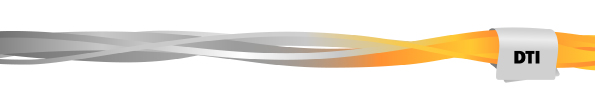

<!DOCTYPE html>
<html lang="fr">
<head>
    <meta charset="UTF-8">
    <meta name="viewport" content="width=device-width, initial-scale=1.0">
    <title>Compte rendu Collaboration RTL Group/Bertelsmann</title>
    
</head>
<body>
    <header>
        
    </header>
    

        <h1>Compte rendu Collaboration RTL Group/Bertelsmann</h1>
        
Sélectionnez un compte rendu pour consulter les détails :

        <ul class="link-list">
            <li>
                <a href="https://groupm6-my.sharepoint.com/:b:/g/personal/angela_ngonjel_m6_fr/EaJ7Pf73Nk5Ai7t5u1rn0LEBAuNb5Jb-zhpbZ4DKVRps9w?e=L8L9uh" target="_blank" rel="noopener noreferrer">
                    Compte rendu Ragday
                </a>
            </li>
            <li>
                <a href="https://groupm6-my.sharepoint.com/:b:/g/personal/angela_ngonjel_m6_fr/EYewQc1uTBxPt-i7JbcNDGQBHjaXHjFRbH_evp50jjLVjA?e=MCrCTh" target="_blank" rel="noopener noreferrer">
                    Compte rendu Datasyco Novembre 2024 (Français)
                </a>
            </li>
            <li>
                <a href="https://groupm6-my.sharepoint.com/:b:/g/personal/angela_ngonjel_m6_fr/EYewQc1uTBxPt-i7JbcNDGQBHjaXHjFRbH_evp50jjLVjA?e=GMDIFz" target="_blank" rel="noopener noreferrer">
                    Compte rendu Datasyco Novembre 2024 (Anglais)
                </a>
            </li>
        </ul>
    

</body>
</html>
